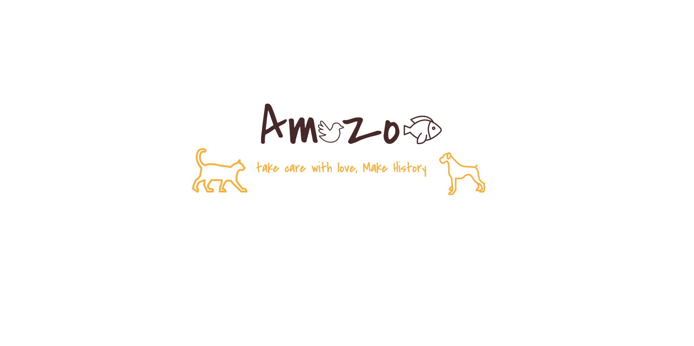

# Amazoo

## Escopo

A Amazoo seria uma loja virtual que ofereceria uma ampla variedade de 
produtos para animais, desde alimentos e acessórios até brinquedos e produtos 
de higiene. A plataforma permitiria que os clientes encontrassem facilmente os 
produtos de que precisam, utilizando filtros para pesquisar por categoria, marca, 
preço e outros critérios.
Os clientes poderiam criar perfis pessoais na plataforma, onde teriam 
acesso a informações sobre seus pedidos, histórico de compras e informações 
de pagamento. A Amazoo também ofereceria programas de fidelidade e 
descontos para incentivar a lealdade dos clientes.
Além disso, a Amazoo teria uma seção de informações úteis e 
educacionais para ajudar os donos de animais a cuidarem melhor de seus 
animais de estimação. A seção poderia incluir artigos, vídeos e fóruns de 
discussão onde os clientes poderiam trocar informações e experiências sobre os 
cuidados com seus animais.
Para garantir a segurança dos clientes, a Amazoo implementaria medidas 
de segurança rigorosas para proteger as informações de pagamento e dados 
pessoais dos usuários. A loja também teria uma equipe de atendimento ao cliente 
disponível para ajudar os clientes com quaisquer dúvidas ou problemas que 
possam ter.
Em resumo, a Amazoo seria uma loja virtual especializada em produtos
para animais, oferecendo uma ampla variedade de produtos, programas de 
fidelidade, informações úteis e medidas de segurança rigorosas para garantir a 
satisfação e fidelidade dos clientes.

## DER

